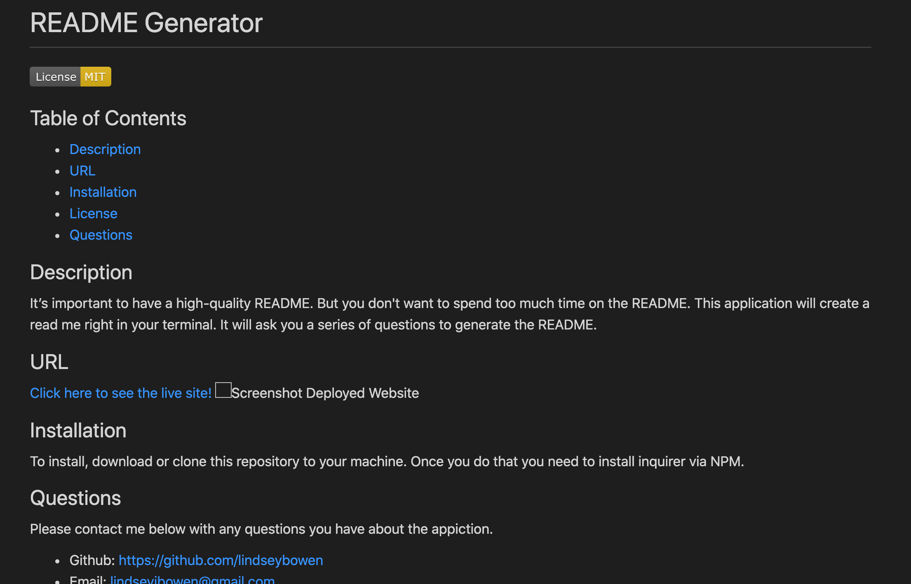

# README Generator

## Table of Contents
* [Description](#description)
* [URL](#url)
* [Installation](#installation)
* [Credits](#credits)
* [License](#license)
* [Contributing](#contributing)
* [Tests](#tests)
* [Questions](#questions)
## Description 
It’s important to have a high-quality README. But you don't want to spend too much time on the README. This application will create a read me right in your terminal. It will ask you a series of questions to generate the README. 
## URL
[Click here to see the live site!](https://drive.google.com/file/d/1ztUJjhugDPFdgF7zwMoHOsdiT4XBleur/view?usp=sharing)

## Installation
To install, download or clone this repository to your machine. Once you do that you need to install inquirer via NPM.
## Questions
Please contact me below with any questions you have about the appiction.
* Github: https://github.com/lindseybowen
* Email: lindseyjbowen@gmail.com
    